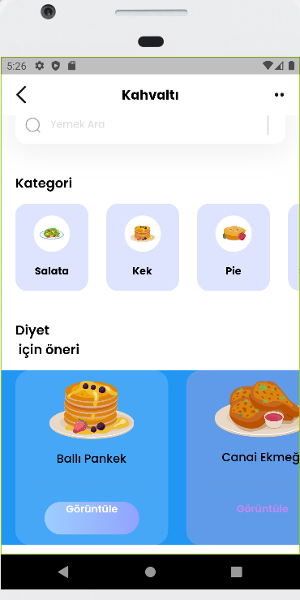

<h1>Flutter ile Kahvaltı uygulaması</h1>

Diyet yapmak isteyenler için, ideal olan ve popüler olan yemekler listelendi.

main.dart kısmına bir Anasayfa kısmını bağlayarak oluşturacağımız bütün işlemleri tek bir sayfaya bağladık.

Statik listeler içinde fotoğrafı,adı,süresi gibi içerisindeki kısımları oluşturarak daha az kod yazmayı sağladım.

Makalesini okumak için ise: https://medium.com/@mrtylmz863/flutter-ile-basit-bir-mobil-kahvalt%C4%B1-uygulamas%C4%B1-93a50ab27d24 bu sayfaya giderek göz atabilirsiniz.

